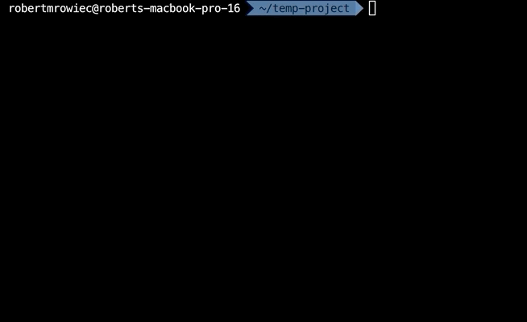
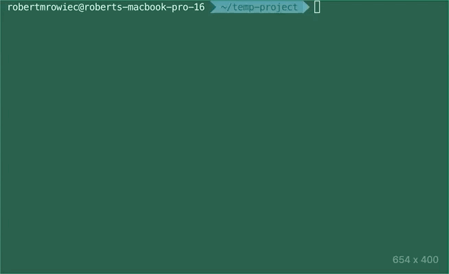

# Overview 
This page will guide You how [`SurpriseJS`](https://www.npmjs.com/package/SurpriseJS) framework works. <br> 
<br>

SurpriseJS is an open-source JavaScript library / framework which easily generates your Node.js backend with MongoDB database connection with just a few clicks.

<i> *At this moment it works only with above-mentioned framework and DB, but soon will also work with PostgreSQL and Koa.js. Every help is appreciated. </i>

This framework can generate: 

* Core of Node.js application
* Basic CRUD ( with pagination and filtering )
* Routes with models
* Auth (by JsonWebToken) with authorization middleware
* CORS

## Prerequisites
You will need the following things installed on your computer.

* [Node.js](http://nodejs.org/) (with NPM)
* [MongoDB](http://mongodb.com/)

# Setup
## Installation

Just simply install package with npm globally:

`npm install -g surprisejs`

# Configuration

Just type `surprisejs` in Your terminal and select one of available methods described in section below:

* `auth`
* `core`
* `cors`
* [`crud`](https://robertmrowiec.github.io/surprise-crud-page)
* `route`

# Available Methods

## Auth
Auth middleware will listen for specified prefix routes and allow only connections with defined authentication process.

By default it requires sending `Authorization: Bearer *token*` header during requests.

After select this option, You will be asked about Your application endpoints prefix (i.e. `/api`).

Auth middleware adds decoded token to `req.user` by default. So You can change 
```
{ foo: 'bar' }
```
in token generate endpoint with user data from database. Something like:
```
  const user = await User.findOne({ email: req.body.email })
  if (user.password == hashed(req.body.password)){ // hashed is example of function to hash password for future compare
    const token = jwt.sign(user, secret);
    return res.status(200).json({
      token,
      message: 'Succesfully logged'
    })
  }
```

Of course You have to had User model defined and handle login by provided email and password.

In the meantime:

 -[jsonwebtoken](https://github.com/auth0/node-jsonwebtoken) will be installed, 

 -Authorization middleware will be added to `/middleware` directory and used in `app.js`,

 -Login route will be created and defined as `/login` endpoint with 2 available endpoints:

* Login - returns token
```
Method: POST, path: /login
```

* Verify
```
Method: GET, path: /login/verify/:token
```

## Core
Generates core of Node.js application like `package.json`, folders for `routes` and `models`, and most important:

_app.js_
```app.js
const express = require('express');
const mongoose = require('mongoose');
const bodyParser = require('body-parser');
const app = express();

mongoose.set('useCreateIndex', true);

app.use(bodyParser.urlencoded({ extended: true }));
app.use(bodyParser.json());

module.exports = dbUrl => mongoose.connect(dbUrl, {
  useNewUrlParser: true,
  useUnifiedTopology: true
}).then(() => app);
```

and

_index.js_
```index.js_
#!/usr/bin/env node
require('./app')('mongodb://localhost/Your-database-name').then(app => {
  console.log('Server is running on port 3000');
  app.listen(3000);
});
```

App structure:
```structure
project
├── models/
│
├── routes/
│
├── app.js
├── index.js
├── package.json
```

In the meantime it also install all required NPMs: <br>
-[express](https://expressjs.com)<br>
-[mongoose](https://mongoosejs.com)

## CORS
Adds CORS handling to the application. You can customize on which URLs Your application will work.

After selecting this, You have option to choose between basic and advanced CORS configuration.

### Basic
Default schema:
```
app.use(require('surprisejs-cors)( allowedOrigins, allowedHeaders ))
```

`allowedHeaders` is optional

Default setup:
```app.js
app.use(require('surprise-cors')('*'))
```

#### Customised URLs:

 -single URL:
```app.js
app.use(require('surprise-cors')('http://localhost:3000'))
```

 -multiple URLs:
```app.js
app.use(require('surprise-cors')(['http://localhost:3000', 'https://myapp.com']))
```

#### Customised Headers:
```
const headers = 'Content-Type, Authorization, X-Requested-With' // Your list of accepted headers
app.use(require('surprise-cors')('http://localhost:3000', headers))
```

### Advanced
Default setup:
```app.js
const cron = require('cron')
app.use(cron())
```

Customization:
* [cors](https://github.com/expressjs/cors#readme)

## CRUD
Adds default CRUD functionality to specified route.

You can select multiple routes from available list created based on `/routes` folder. After selecting some of them, `routes/*model*/route.js` will have:
```
crud(*Model*, router, { pathFromCollection: false });
```
In the meantime, required NPMs will be installed.

### Available Methods
*  Get 
```
Method: GET, path: /?filter=key&filterBy=value
```
*  GetById 
```
Method: GET, path: /:id
```
*  GetPagination
```
Method: GET, path: /page/:page/limit/:limit?filter=key&filterBy=value
```
*  Post
```
Method: POST, path: /
```
*  Put
```
Method: PUT, path: /:id
```
*  Delete
```
Method: DELETE, path: /:id
```

More details and options (i.e. about `filtering`) here: [CRUD-documentation](https://robertmrowiec.github.io/surprise-crud-page/#/?id=available-methods)

## Route
Generates route and model for endpoint specified by user.

After selecting route option, You have to provide:
* Model name (i.e. `Users`)
* Route name (i.e. `api/users`)

Now, the routes structure will look like this:
```structure
routes/
└─── users/
    └── details.js
    └── router.js
```

New files has commented options with information how to define own endpoints if needed.

# Examples

## Steps:

### 1. Generate base application structure with main files
* Select `core` option
* Provide project name and database name
* Move to your project folder and continue.


### 2. Generate some routes for Your application
* Select `route` option
* Provide model name and endpoint url ( or click enter for default value )



### 3. Generate default CRUD for selected route
* Select `crud` option
* Choose from multi-select on which route You want to add default CRUD


### 4. Add Authentication to application
* Select `auth` option
* Provide endpoints prefix



### 5. Add CORS functionality
* Select `cors` option
* Choose between `Basic` and `Advanced` configuration
* No matter what You choose, SurpriseJS will install required NPM and add configuration to `app.js`


# Problems 
If You get some problems, don't be afraid to create an issue on GitHub :)

# Links

## Github
	https://github.com/RobertMrowiec/SurpriseJS

## NPM
	https://www.npmjs.com/package/surprisejs
